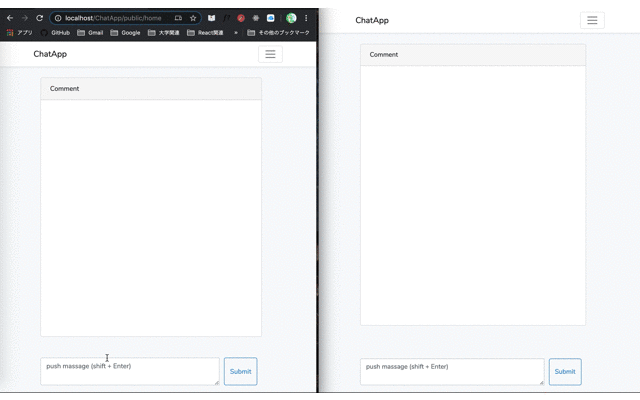
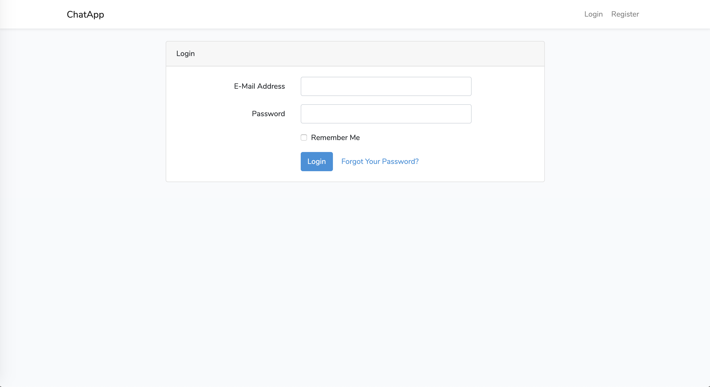
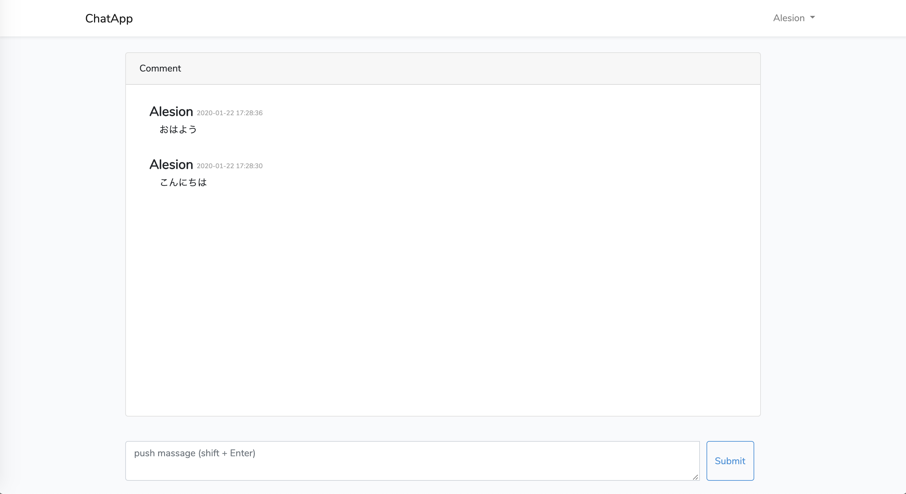

# DEMO

<p align="center">

</p>

# Qiita

[Laravelで非同期チャットアプリを作ろう（１）](https://qiita.com/Alesion30/items/8580a85a09822b067ff9)

[Laravelで非同期チャットアプリを作ろう（２）](https://qiita.com/Alesion30/items/dddb3f162e60b16fdc6d)

# PAGES

### login pages



### home pages



# USAGE

Download ChatApp

```terminal
git clone https://github.com/Alesion30/ChatApp.git
cd ChatApp
composer update
npm install
cp .env.example .env
```

Describe Database information in .env

```.env
DB_CONNECTION=mysql
DB_HOST=127.0.0.1
DB_PORT=3306
DB_DATABASE=ChatApp
DB_USERNAME=(your username)
DB_PASSWORD=(your password)
```

Finally, `The migrate:fresh` command will drop all tables from the database and then execute the `migrate` command.

```terminal
php artisan migrate:fresh --seed
```